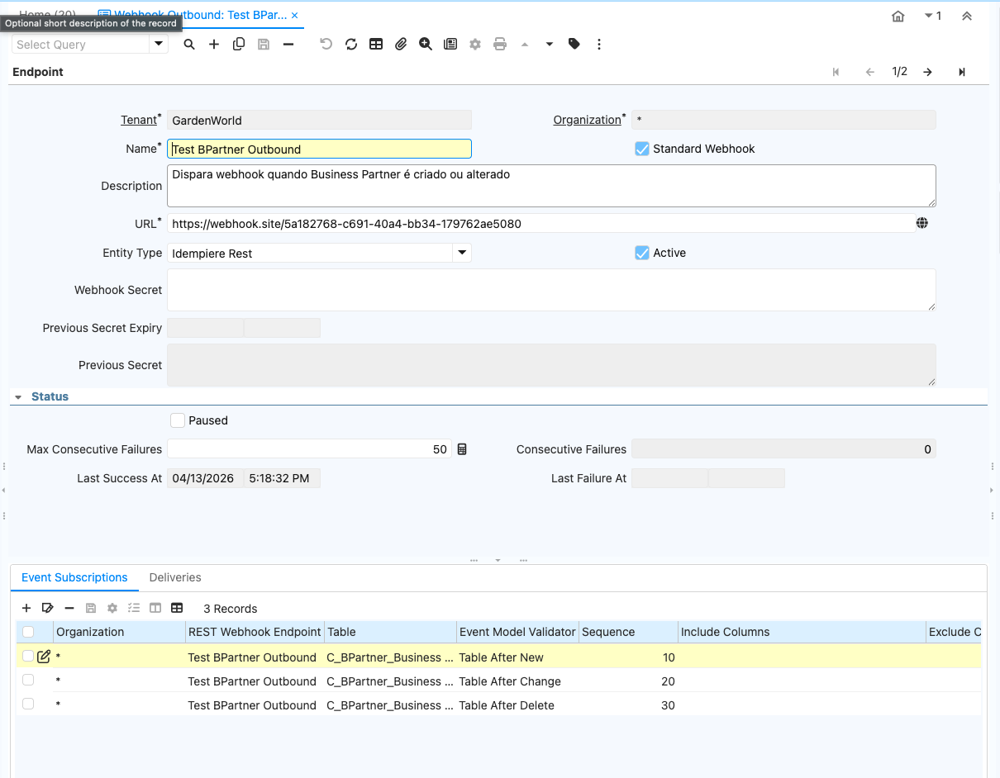
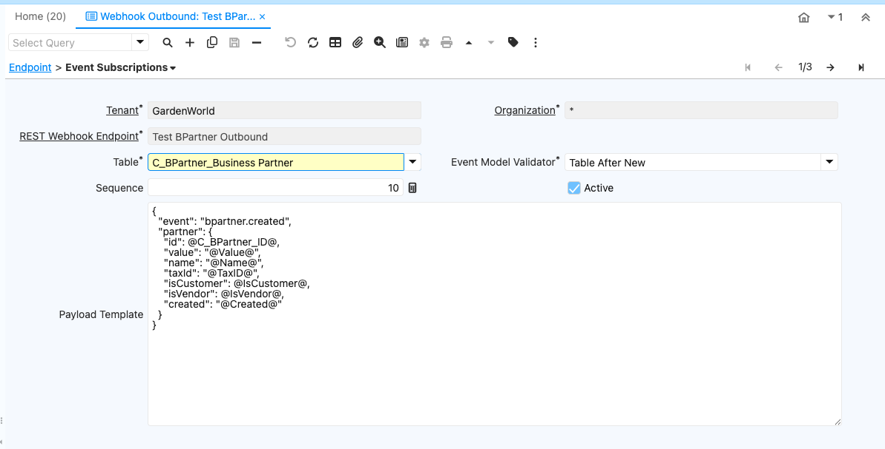
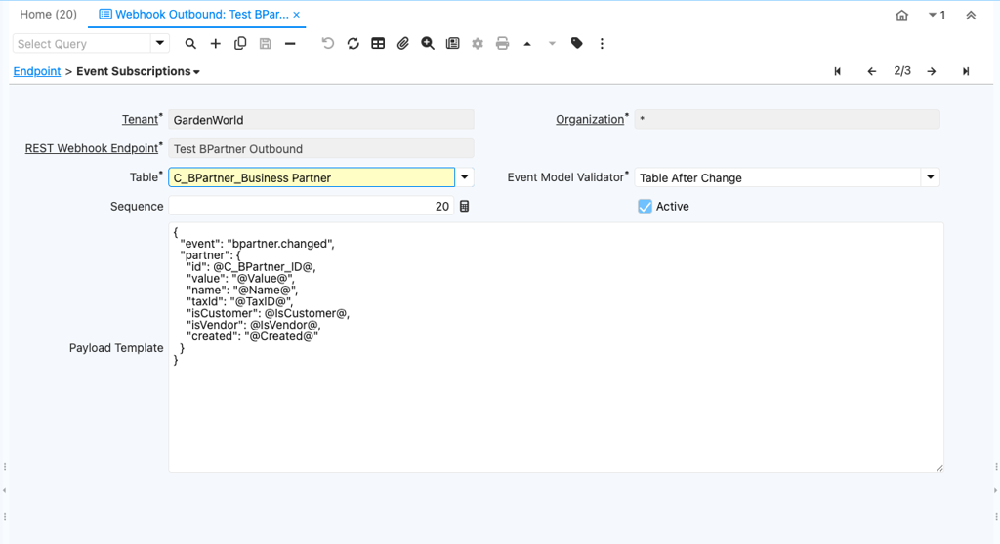
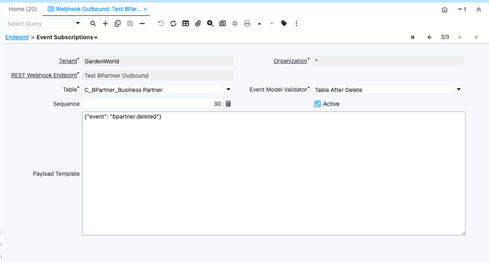
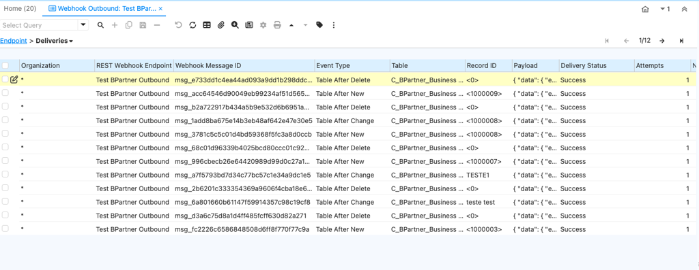
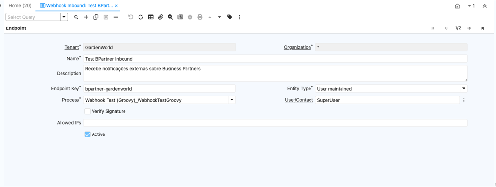
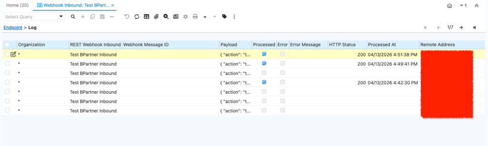

# Webhooks

iDempiere REST ships with a webhook subsystem that follows the [Standard Webhooks](https://www.standardwebhooks.com) specification. It supports both directions:

- **Outbound** — emit signed HTTP POSTs when records change in iDempiere (created / updated / deleted) or when documents transition (Complete / Void / Close / …).
- **Inbound** — accept signed HTTP POSTs at `/api/v1/webhooks/{key}` and route the payload into an `AD_Process` for handling in Groovy or Java.

Outbound payloads are wrapped in a Standard Webhooks envelope and signed with HMAC-SHA256, so the receiver can verify authenticity. Inbound endpoints can require the same signature on incoming requests.

:::tip Master switches
Both directions are gated by client-level SysConfig flags (`REST_WEBHOOK_ENABLED`, `REST_WEBHOOK_INBOUND_ENABLED`). Disable them per tenant without touching individual endpoints.
:::

---

## 1. Outbound Webhook Setup

### 1.1 Create the Endpoint

**Window:** *Webhook Outbound* → **Tab:** *Endpoint*

| Field | Value | Notes |
|---|---|---|
| **Name** | e.g. `ERP Events → Partner System` | Descriptive name. |
| **URL** | `https://partner.com/webhooks/idempiere` | Must accept `POST`. Redirects are **not** followed (per Standard Webhooks). |
| **Webhook Secret** | `whsec_…` | **Auto-generated** on save when `IsStandardWebhook = Y` and the field is empty. To set a specific value (e.g. dictated by a partner), paste it before saving — it will be preserved. To generate manually: `openssl rand -base64 32`, prefix with `whsec_`. |
| **Is Standard Webhook** | `Y` | `Y` = envelope + HMAC headers. `N` = raw payload, no signing (e.g. Google Chat, Slack). Default: `Y`. |
| **Paused** | `N` | Set `Y` to queue without delivering. Auto-set to `Y` after `MaxConsecutiveFailures` is reached. |
| **Max Consecutive Failures** | `50` | Auto-pauses endpoint after N consecutive failures. `0` disables the auto-pause. Negative values are rejected. |



### 1.2 Subscribe to Events

**Tab:** *Event Subscriptions*

| Field | Value | Notes |
|---|---|---|
| **Table** | e.g. `C_BPartner` | Table to monitor. |
| **Event Model Validator** | `TAN` / `TAC` / `TAD` / `DACO` / … | Same codes as `AD_Table_ScriptValidator` (Reference 53237). |
| **Sequence** | `10` | Execution order. |
| **Payload Template** | *(optional)* | Custom JSON with `@ColumnName@` variables. Empty = full PO serialization. |

**Common event codes:**

| Code | Event |
|---|---|
| `TAN` | Table After New (record created) |
| `TAC` | Table After Change (record updated) |
| `TAD` | Table After Delete (record deleted) |
| `DACO` | Document After Complete |
| `DAVO` | Document After Void |
| `DACL` | Document After Close |

**Payload Template example:**

```json
{"event": "bpartner.created", "id": @C_BPartner_ID@, "name": "@Name@", "taxId": "@TaxID@"}
```

- `@ColumnName@` resolves from the source `PO`.
- Quoted `"@Col@"` with a `null` value → field is **omitted** from the payload.
- Unquoted `@Col@` with a `null` value → emits JSON `null`.
- When a template is set, `IncludeColumns`/`ExcludeColumns` are ignored.






### 1.3 Monitor Deliveries

**Tab:** *Deliveries* (read-only)

Shows every delivery attempt with status, HTTP status code, response body, attempt count, and next retry time.




| Status | Meaning |
|---|---|
| `P` — Pending | Queued for delivery (or waiting on `NextRetryAt`). |
| `I` — In Progress | A worker has claimed the row and is sending the request. Auto-recovered to `Pending` after 5 min if the worker dies mid-flight. |
| `S` — Success | Delivered, 2xx response received. |
| `F` — Failed | Currently unused (failures stay `Pending` until abandoned). |
| `A` — Abandoned | Max retries reached. No more attempts. |

:::note Stored response size
`ResponseBody` and `ErrorMessage` are truncated to `REST_WEBHOOK_LOG_MAX_LENGTH` chars (default 2000). Set to `0` to skip storing the bodies entirely.
:::

### 1.4 Secret Rotation

To rotate secrets without downtime:

1. Generate a new secret.
2. Copy the **current** value into **Previous Secret**.
3. Set **Previous Secret Expiry** (e.g. 24h from now).
4. Replace **Webhook Secret** with the new value.

Both secrets sign payloads until the expiry passes. The receiver should accept either. Outbound deliveries include both signatures, space-delimited (Standard Webhooks).

---

## 2. Inbound Webhook Setup

### 2.1 Create the Endpoint

**Window:** *Webhook Inbound* → **Tab:** *Inbound Endpoint*

| Field | Value | Notes |
|---|---|---|
| **Name** | e.g. `Test BPartner Inbound` | Descriptive name. |
| **Endpoint Key** | `bpartner-gardenworld` | URL-safe, lowercase. Full URL: `/api/v1/webhooks/bpartner-gardenworld`. |
| **Verify Signature** | `Y` / `N` | `Y` = requires Standard Webhooks HMAC headers. `N` = accepts unsigned requests. |
| **Webhook Secret** | `whsec_…` | Required when `Verify Signature = Y`. Min 24 bytes after base64-decoding. |
| **Process** | e.g. `Webhook Test (Groovy)` | `AD_Process` that receives the payload. |
| **User/Contact** | *(required)* | Process runs as this user. The endpoint is rejected if `AD_User_ID` is unset (no implicit `SuperUser` fallback). |
| **Allowed IPs** | *(optional)* | Comma-separated IPs or CIDR. Empty = all allowed. e.g. `192.168.1.0/24,10.0.0.5`. |



### 2.2 Create the Target Process

The `AD_Process` must declare a parameter named `WebhookPayload` (`AD_Reference: Text`) to receive the request body.

#### Option A — Groovy

1. Create `AD_Rule`: `Value = groovy:MyWebhookHandler`, `RuleType = S` (JSR 223), `EventType = P` (Process).
2. Create `AD_Process`: `Classname = @script:groovy:MyWebhookHandler`.
3. Add `AD_Process_Para`: `ColumnName = WebhookPayload`, `Reference = 14` (Text).

The script accesses the body via `P_WebhookPayload`.

#### Option B — Java

1. Create a class extending `SvrProcess` with a `@Parameter(name="WebhookPayload")` field.
2. Register it in `AD_Process` with the fully-qualified classname.

### 2.3 Monitor Logs

**Tab:** *Log* (read-only)

Shows every received webhook with payload, processed flag, error status, remote IP, and processing timestamp.



### 2.4 Test with `curl`

**Without signature** (works only when `Verify Signature = N`):

```bash
curl -X POST https://your-server/api/v1/webhooks/bpartner-gardenworld \
  -H "Content-Type: application/json" \
  -d '{"txid":"abc123","amount":150.00}'
```

**With signature:**

```bash
SECRET_BASE64="<base64 part after whsec_>"
BODY='{"txid":"abc123","amount":150.00}'
MSG_ID="msg_$(uuidgen)"
TIMESTAMP=$(date +%s)
SIGNATURE=$(echo -n "${MSG_ID}.${TIMESTAMP}.${BODY}" \
  | openssl dgst -sha256 -hmac "$(echo -n "$SECRET_BASE64" | base64 -d)" -binary | base64)

curl -X POST https://your-server/api/v1/webhooks/bpartner-gardenworld \
  -H "Content-Type: application/json" \
  -H "webhook-id: ${MSG_ID}" \
  -H "webhook-timestamp: ${TIMESTAMP}" \
  -H "webhook-signature: v1,${SIGNATURE}" \
  -d "$BODY"
```

:::caution `webhook-id` and deduplication
- When `Verify Signature = Y`, `webhook-id` is **mandatory**. Requests without it are rejected with `400`.
- When `Verify Signature = N`, `webhook-id` is **optional**. If the sender doesn't include one, a synthetic id is generated and **deduplication is effectively disabled** for that request — duplicates from non-Standard providers can't be detected by id.
- When present, `webhook-id` is unique per inbound endpoint: a duplicate returns `200 {"status":"duplicate"}` without re-running the process.
:::

### 2.5 Behind a Reverse Proxy

If iDempiere REST sits behind a reverse proxy (nginx, traefik, ALB, …), the IP allowlist would otherwise see the proxy's address — not the real client. Configure trusted proxies via SysConfig so the platform can resolve the original client IP from `X-Forwarded-For`:

```
Key:   REST_WEBHOOK_TRUSTED_PROXIES
Level: System
Value: 10.0.0.5,192.168.0.0/24
```

The resolver walks the `X-Forwarded-For` chain right-to-left and picks the first hop **not** in `TRUSTED_PROXIES`, so a malicious client can't spoof an IP further left in the chain. Default value is `none` — no proxies trusted, the connection-level remote address is always used.

---

## 3. Infrastructure Configuration

### 3.1 SysConfig Parameters

| Key | Default | Level | Description |
|---|---|---|---|
| `REST_WEBHOOK_ENABLED` | `Y` | Client | Master switch for outbound webhooks. |
| `REST_WEBHOOK_INBOUND_ENABLED` | `Y` | Client | Master switch for inbound webhooks. |
| `REST_WEBHOOK_MAX_RETRIES` | `10` | System | Max delivery attempts before abandoning a delivery. |
| `REST_WEBHOOK_TIMEOUT_MS` | `15000` | Client | HTTP timeout for outbound delivery (in milliseconds). |
| `REST_WEBHOOK_MAX_PAYLOAD_SIZE` | `20480` | Client | Max outbound payload size in bytes. Larger payloads are dropped with a warning. |
| `REST_WEBHOOK_LOG_MAX_LENGTH` | `2000` | Client | Max stored length (chars) for `ResponseBody` and `ErrorMessage` on outbound delivery logs. `0` skips storing them. |
| `REST_WEBHOOK_TRUSTED_PROXIES` | `none` | System | Comma-separated IPs / CIDRs of reverse proxies allowed to set `X-Forwarded-For`. See [§2.5](#25-behind-a-reverse-proxy). |

### 3.2 Scheduler

The process **Webhook Retry Processor** must be registered in `AD_Scheduler`:

- **Client:** *System (0)*
- **Frequency:** every 10 minutes
- **Active:** `Y`

Without this scheduler, failed deliveries are never retried, abandoned deliveries don't get marked, and SLA-breach observability is reduced. The scheduler also picks up *stuck* `IN_PROGRESS` rows whose worker died mid-flight (older than 5 min) — but in normal operation the dispatcher recovers them on the next dispatch attempt without the scheduler's help.

### 3.3 Dispatcher Thread Pool

Outbound deliveries run on a dedicated thread pool (4 core / 16 max threads, bounded queue of 500). When the queue saturates (e.g. retry burst after a partner outage), incoming dispatch calls run on the caller thread (`CallerRunsPolicy`) — this provides natural backpressure rather than dropping deliveries. The pool shuts down gracefully when the bundle stops, with up to 10s grace for in-flight HTTP calls.

---

## 4. Standard Webhooks Headers (Outbound)

Every outbound delivery (when `IsStandardWebhook = Y`) includes:

| Header | Format | Example |
|---|---|---|
| `webhook-id` | `msg_<uuid>` | `msg_a1b2c3d4-…` |
| `webhook-timestamp` | Unix epoch seconds | `1681234567` |
| `webhook-signature` | `v1,<base64>` (space-separated for rotation) | `v1,K7gNU3sdo+OL…` |

Receiver verifies: `HMAC-SHA256(base64decode(secret), "msgId.timestamp.body")` and compares constant-time against the `webhook-signature` value.

Retry schedule follows the Standard Webhooks exponential backoff: immediate, then 5s, 5min, 30min, 2h, 5h, 10h, 14h, 20h, 24h. Each delay is jittered ±15% to avoid retry storms.

---

## 5. Limitations & Roadmap

The current implementation is feature-complete for the most common use cases (REST/JSON integrations with signed Standard Webhooks providers), but a few areas are intentionally minimal in this first release. They are documented here so integrators can plan around them, and they are queued for follow-up tickets.

### 5.1 Inbound payload size

The webhook body is delivered to the target process through the `WebhookPayload` parameter (`AD_Reference: Text`). When iDempiere persists `AD_PInstance_Para.P_String`, the underlying column is **limited to 4000 characters**. Payloads larger than that will be silently truncated when the process reads the parameter back from the database.

**Workaround today:** if the integration genuinely needs > 4000 chars, the column size on `AD_PInstance_Para.P_String` has to be increased at the core level (this has been done before for similar use cases). To avoid surprises we plan to add an explicit length validation in the inbound handler that rejects oversized payloads with a clear error.

**Roadmap:** validate against the `P_String` column length at receive time and reject with `413 Payload Too Large` instead of letting the process see a truncated body.

### 5.2 Content-Type / non-JSON payloads

Today the handler treats the request body as opaque text and forwards it as-is to the process. JSON and XML "just work" because both are text. There is **no field on the inbound endpoint to declare the expected `Content-Type`**, which means:

- Wrong-format bodies are not rejected up front — the process has to handle parse errors itself.
- Binary payloads (IoT, telemetry, image-bearing webhooks, …) are not natively supported.

**Roadmap:**
- Add an **Expected Content-Type** field on the inbound endpoint and reject non-matching requests early with `415 Unsupported Media Type`.
- For binary payloads, evaluate base64-encoding the body before passing it to the `WebhookPayload` parameter so the existing `Text` parameter still works. The Standard Webhooks spec is being reviewed for any guidance / convention on binary handling before settling on the encoding.

### 5.3 Outbound conditional logic

Event subscriptions today fire on every event of the configured `Event Model Validator` for the configured table. There is no way to attach a *condition* (e.g. "only deliver `DACO` events when `DocStatus = CO` and `GrandTotal > 1000`") without writing a custom payload-template trick or shaping it on the receiver.

**Roadmap:** add a per-subscription **Condition** field (SQL or Java/Groovy expression evaluated against the source PO) that filters events before they enqueue a delivery.

### 5.4 What's already in scope

For reference, the following items were considered during review and are **already implemented** in this release:

- Auto-generated webhook secret on save when none is provided (Standard Webhooks mode).
- Atomic claim of a delivery row (`DeliveryStatus = I`) so concurrent dispatchers (event handler vs scheduler) don't double-deliver, with automatic recovery of stuck rows after 5 minutes.
- Dedicated dispatch thread pool with bounded queue and graceful shutdown on bundle stop.
- Negative-cache for unknown inbound endpoint keys to avoid a DB hit per request on bad URLs.
- `X-Forwarded-For` resolution gated by a system-level trusted-proxies allowlist.
- Conditional `webhook-id` requirement (mandatory when signing is on, optional otherwise).
- Strict signature verification: malformed `v1,` signatures raise an error instead of being silently skipped.
